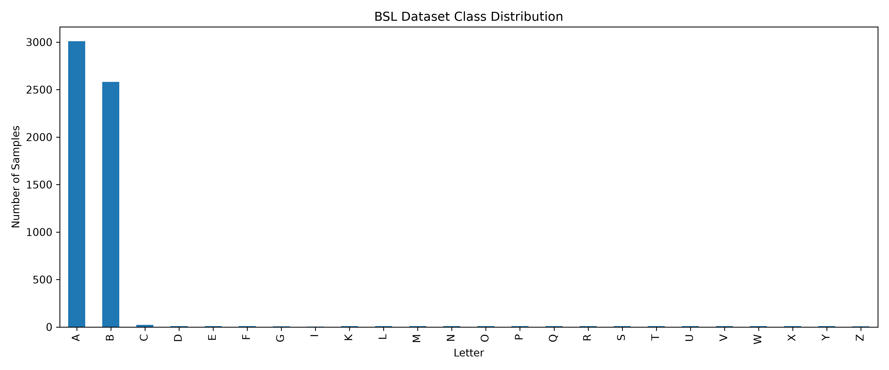
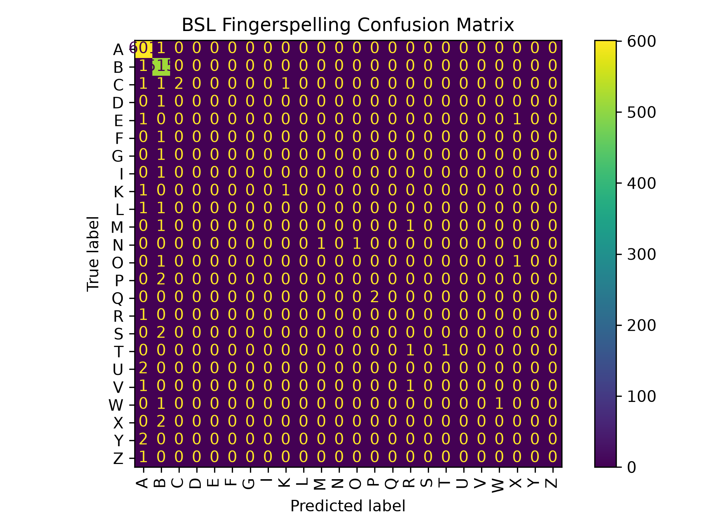

# British Sign Language (BSL) fingerspelling alphabet - Prototype
<!--demo and questionnaire pending -->


> Problem Statement
> 
> Build a machine learning system that recognises the british sign language alphabets from images.
> 
> A feature is the input or the question you give to the machine and the label is the answer of that question. The system checks whether the machine has gotten the answer right by comparing the label and based on how it does on the test, the accuracy score is predicted.


## Methodology

 ```
BSL image dataset
       ↓
combine available images
       ↓
MediaPipe hand detection
       ↓
21 landmarks × 3 coordinates
       ↓
63 numerical features
       ↓
Random Forest
       ↓
letter prediction
       ↓
webcam test
```


  
## Feature Extraction
  > MediaPipe detects the hand and extracts 21 landmarks. Each landmark contains x, y and z coordinates, resulting in 63 numerical features per image.
> These features are stored in landmarks.csv and later used as input to the Random Forest classifier.
  
## Project Structure

```text
sign-language-ai-v2/
│
├── dataset/
│   └── .gitkeep
│
├── landmarks/
│   └── landmarks.csv
│
├── models/
│   |── hand_landmarker.task
|   |__ sign_language_rf.pkl
|   |__ bsl_sign_language_rf.pkl
│
├── src/
│   ├── test_landmarker.py
|   ├── inspect_data.py  
│   ├── extract_landmarks.py
│   |── train_model.py
|   └──live_demo.py
|   └── bsl_webcam.py
    └── evaluate_model.py
|   └── prepare_dataset.py
│
├── .gitignore
├── README.md
|__ requirements.txt
```

## Dataset
- The BSL data used in this prototype was obtained from the [Kaggle BSL Fingerspelling Dataset](https://www.kaggle.com/datasets/alifsathar/bsl-fingerspelling-dataset).
- The dataset itself is not included in this repository.
- The available dataset was highly imbalanced. Most of the extracted samples belonged to the A and B classes, while several other classes contained only a small number of samples.
-  H and J were also absent from the available data.
- For this prototype, the available images were combined and a new 80/20 stratified train/test split was created.

## Installation
1. Download the British Sign Language (BSL) Fingerspelling Dataset from Kaggle.
2. Place the dataset in the project's dataset/ directory.
3. Install the required Python packages listed in requirements.txt.
4. Run the dataset preparation script.
5. Extract the hand landmarks.
6. Train the Random Forest model.

## Run It
```bash
Prepare the dataset:

python src/prepare_dataset.py

Extract hand landmarks:

python src/extract_landmarks.py

Train the model:

python src/train_model.py

Run the BSL webcam prototype:

python src/bsl_webcam.py
```
> [!NOTE]
>
> Press Q to exit the video capturing.
## Demo
## Results

| Item | Details |
|---|---:|
|Dataset| British Sign Language Fingerspelling Dataset |
| Hand Landmarks | 21 |
|Model | Random Forest |
|Features per image| 63|
|Classes| 24|
|Test Split| 20%|
|Test Accuracy| 96.72%|

> [!NOTE]
>
> The 99.64% test accuracy was obtained using the newly constructed 80/20 stratified split of the available extracted data.
>
> Because the dataset is highly imbalanced, this accuracy does not represent reliable real-world webcam performance.
>
> Webcam testing showed poor generalisation to new hand gestures.

## Webcam Demo

<p>A webcam prototype was implemented using OpenCV and MediaPipe.

The system successfully detected and classified some of the dominant classes, particularly A and B. However, most other letters were not reliably recognised during live testing.

This revealed a significant limitation of the current dataset: the model had very little training data for many classes.

The webcam experiment therefore demonstrated that high test accuracy on this dataset did not translate into reliable real-world recognition.</p>

```text

Dataset
   ↓
Severely imbalanced
   ↓
Model performs well on A/B
   ↓
Very little training data for most letters
   ↓
Poor webcam generalisation

```

## Limitations

- The available dataset is highly imbalanced.
- A and B account for the majority of the extracted samples.
- H and J are absent from the available dataset.
- The current model therefore does not represent a complete BSL alphabet.
- Webcam testing showed poor generalisation despite the high test accuracy.
- The prototype uses a single detected hand, while BSL fingerspelling can involve two hands.
- The system recognises individual letters rather than complete words or sentences.

  | Item | Details |
|---|---:|
|Available classes| 24 |
| Test samples | 1519 |
|Accuracy | 96.72% |
|Macro F1| 0.18 |
   Strong classes| A,B |
  Webcam results| A/B worked. Others are pending|

## What's next
1. Use a larger and more balanced BSL dataset.
2. Improve generalisation to real-world webcam inputs.
3. Investigate data augmentation techniques.
4. Compare different machine learning models.
5. Explore recognition of complete words rather than individual letters.
    
## Conclusion

> This project is a prototype for British Sign Language (BSL) fingerspelling recognition using hand landmarks and a Random Forest classifier.
>
> MediaPipe detects 21 hand landmarks from an image or webcam frame. The x, y and z coordinates of these landmarks produce 63 numerical features, which are then passed to the trained Random Forest model to predict a letter.
>
>Although the model achieved high test accuracy on the available dataset, webcam testing revealed poor generalisation. The main limitations were the severe class imbalance and the lack of data for several letters.
>
 ## Evaluation

The model achieved an overall test accuracy of 96.72% on 1,159 test samples. However, the dataset was highly imbalanced, with A and B accounting for the vast majority of the samples.

The model achieved high F1-scores for A (0.99) and B (0.98), while most other classes had very limited test samples and received an F1-score of 0. The macro F1-score was 0.18, indicating poor and uneven performance across classes.

Therefore, the overall accuracy should not be interpreted as representative of real-world BSL recognition performance. Webcam testing also showed poor generalisation to new hand gestures.

### Class Distribution



### Confusion Matrix



## Author
__Manha Ayyan Kuzhiyan__
 [Github](https://github.com/leffraun)
## References
- [British Fingerspelling Dataset – Kaggle](https://www.kaggle.com/datasets/alifsathar/bsl-fingerspelling-dataset)
- [MediaPipe Documentation](https://ai.google.dev/edge/mediapipe/solutions/guide)
- [OpenCV Documentation](https://docs.opencv.org/)
- [Scikit-learn Documentation](https://scikit-learn.org/stable/)
